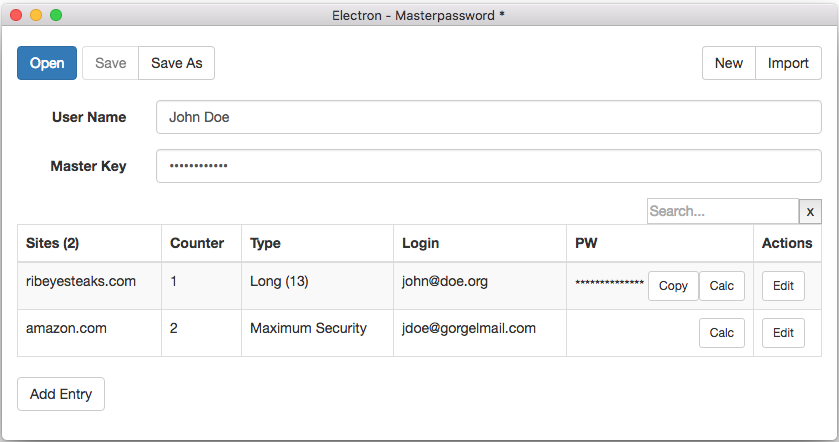

# Electron MPW

This is an Electron based desktop app for managing passwords following the principle of "master password" from Maarten Billemont, Lyndir (http://masterpasswordapp.com/).

This is an independent implementation from a different author following the published algorithm.

Features:
* Loads+saves configuration in XML, compatible with https://github.com/gomasch/DotNetMasterPassword.
* Import 2nd file with manual merge
* Simple search

Techniques:
* Pure Javascript with Electron.  
* UI with React and Bootstrap.
* Uses emscripten-compiled SCRYPT implementation from https://github.com/tonyg/js-scrypt
* Main editor/IDE was VSCode.

## Motivation
On iPhone I am using the original app from Maarten Billemont. For the desktop I didn't like the original Java app and decided 2015 to build simple desktop apps for Win+Mac with C#. The result can be found at https://github.com/gomasch/DotNetMasterPassword.

When trying to add some features (import, search) later in 2017, I grew uncomfortable with the C# solution and took that as an excuse to explore a completely new (and new-to-me) stack: build a cross plattform UI app with Electron, Javascript and HTML. It worked suprisingly well. I was especially pleased with npm, React and the speed of emscripten-based js-scrypt.

## Open Issues

While the current state is already providing value for me there is lot's of room for improvement. Especially creating and managing releases and switching to a custom menu is on the list.

## About

AUTHOR 
Martin Schmidt mail@gomasch.de Rostock, Germany

LICENSE 
MIT License 
http://opensource.org/licenses/MIT

LICENSES of used libraries
* <a href="external/js-scrypt/LICENSE.md">License js-scrypt and scrypt</a>
* see <a href="package.json">package.json</a> for remaining used npm libraries.